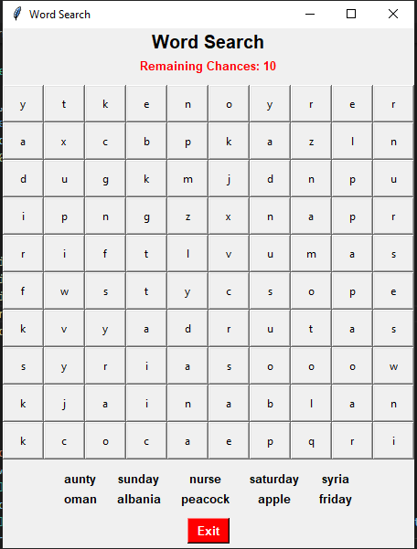
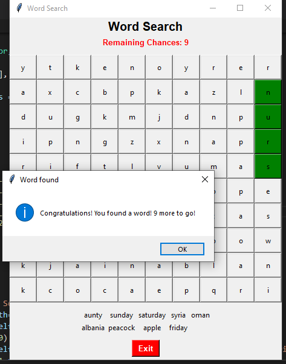
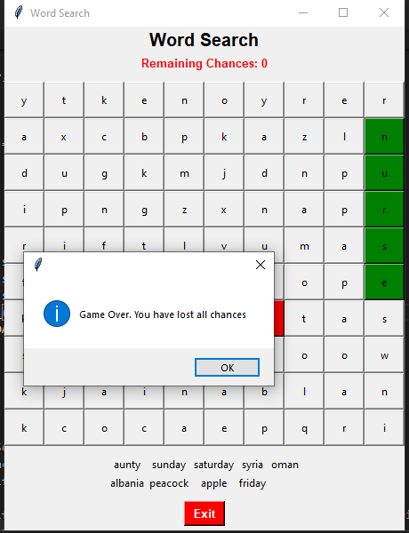

# Words Searching Game
**Words Search** is a game created using the **Python's Tkinter Library**. This game randomly arranges **10 different words**, obtained 
from a word bank, in **different orientations**. The player has to choose the correct letters that makes a whole word. If the player 
selects a wrong letter, he/she **loses a chance**. There are **total 10 chances**. If all chances are gone, the game ends. There is an 
exit button as well to end the game.

## Sample Images

